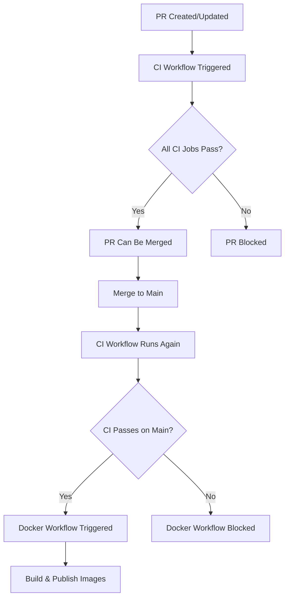

# Branch Protection & CI Gating

This document describes the strict CI gating strategy implemented for the `solve-it-mcp` repository to ensure code quality and prevent broken releases.

---

## 🛡️ Overview

**Goal**: Prevent merging code to `main` and publishing Docker images unless all CI checks pass.

**Strategy**: Multi-layered protection using:
1. GitHub Branch Protection Rules (required checks)
2. Workflow dependencies (automated gating)
3. CI status verification (runtime checks)

---

## 📋 Branch Protection Rules

### Configuring Branch Protection for `main`

Navigate to: **Settings → Branches → Branch protection rules → Add rule**

#### Required Settings:

```yaml
Branch name pattern: main

☑ Require a pull request before merging
  ☑ Require approvals: 0 (or 1 if you want self-review)
  ☑ Dismiss stale pull request approvals when new commits are pushed
  ☑ Require review from Code Owners: ☐ (optional)

☑ Require status checks to pass before merging
  ☑ Require branches to be up to date before merging
  
  Required status checks (add these):
    - Code Quality
    - Unit Tests (Python 3.11)
    - Unit Tests (Python 3.12)
    - Build Validation
    - Dockerfile & YAML Linting
    - Dependency Security
    - Security Best Practices
    - CI Summary

☑ Require conversation resolution before merging

☑ Require linear history (recommended)

☑ Do not allow bypassing the above settings
  ☐ Allow specific actors to bypass (optional - for emergencies only)

☐ Restrict who can push to matching branches (optional)

☑ Allow force pushes: ☐ DISABLED
☑ Allow deletions: ☐ DISABLED
```

---

## 🔄 Workflow Dependencies

### CI Workflow → Docker Workflow Flow



### Workflow Trigger Logic

**Docker Build & Publish Workflow** (`docker-publish.yml`) is triggered by:

1. **Push to main** - After merge
2. **Tag creation** (`v*`) - For releases
3. **Pull requests** - For testing (no push)
4. **Workflow run completion** - When CI workflow completes successfully
5. **Manual dispatch** - Emergency override

**Critical**: The `verify-ci` job ensures CI has passed before proceeding.

---

## 🔍 CI Status Verification

### Job: `verify-ci`

This job runs **before all other Docker workflow jobs** and verifies:

#### For `workflow_run` events (CI completion):
```yaml
- Checks: github.event.workflow_run.conclusion == 'success'
- Fails if: CI workflow did not succeed
- Result: Blocks entire Docker workflow if CI failed
```

#### For `push` events (direct to main):
```yaml
- Queries: GitHub API for CI workflow status
- Waits: 10 seconds for CI to initialize
- Checks: All CI workflow runs for the commit
- Fails if: Any CI run failed
- Warns if: CI not found (race condition)
```

#### For `pull_request` and `workflow_dispatch`:
```yaml
- Skipped: PRs run tests independently
- Skipped: Manual triggers allow override (emergencies)
```

---

## 🎯 Required CI Checks

These checks **must pass** before merging to `main`:

### 1. Code Quality
- **Job**: `code-quality`
- **Checks**: Ruff linting, Black formatting, MyPy type checking
- **Duration**: ~2 minutes
- **Failure**: Blocks merge

### 2. Unit Tests (Python 3.11 & 3.12)
- **Job**: `tests` (matrix)
- **Checks**: pytest with coverage, Codecov upload
- **Duration**: ~3 minutes per version
- **Failure**: Blocks merge

### 3. Dependency Security
- **Job**: `dependency-security`
- **Checks**: pip-audit for vulnerable dependencies
- **Duration**: ~1 minute
- **Failure**: Warning (doesn't block, but should be reviewed)

### 4. Dockerfile & YAML Linting
- **Job**: `dockerfile-lint`
- **Checks**: Hadolint, yamllint
- **Duration**: ~1 minute
- **Failure**: Warning (doesn't block currently)

### 5. Build Validation
- **Job**: `build-validation`
- **Checks**: Docker build, smoke tests, multi-arch capability
- **Duration**: ~8 minutes
- **Failure**: Blocks merge

### 6. Security Best Practices
- **Job**: `security-checks`
- **Checks**: Bandit, TruffleHog (secrets detection)
- **Duration**: ~2 minutes
- **Failure**: Warning (doesn't block, but should be reviewed)

### 7. CI Summary
- **Job**: `ci-summary`
- **Checks**: Aggregates all job results
- **Duration**: ~10 seconds
- **Failure**: Never fails (informational)

---

## ⚙️ How It Works

### Scenario 1: Normal PR Flow

```bash
1. Developer creates PR
   ↓
2. CI workflow runs automatically
   ├─ Code Quality ✅
   ├─ Tests (3.11) ✅
   ├─ Tests (3.12) ✅
   ├─ Security ✅
   ├─ Dockerfile Lint ✅
   ├─ Build Validation ✅
   └─ CI Summary ✅
   ↓
3. Docker workflow runs (test mode, no push)
   └─ Quick scan (AMD64 only)
   ↓
4. All checks green → "Merge" button enabled
   ↓
5. Maintainer merges PR
   ↓
6. CI workflow runs on main
   ↓
7. [If CI passes] Docker workflow triggered
   ├─ verify-ci job ✅
   ├─ Full scan (3 platforms)
   └─ Push to Docker Hub
```

### Scenario 2: CI Fails on PR

```bash
1. Developer creates PR
   ↓
2. CI workflow runs
   ├─ Code Quality ✅
   ├─ Tests (3.11) ❌ FAILED
   └─ ... (other jobs)
   ↓
3. "Merge" button DISABLED
   ↓
4. Developer fixes tests, pushes new commit
   ↓
5. CI runs again...
   └─ All checks ✅
   ↓
6. "Merge" button ENABLED
```

### Scenario 3: Release Tag Created

```bash
1. Maintainer creates tag: v0.2025-10-0.1.0
   ↓
2. Tag pushed to GitHub
   ↓
3. CI workflow triggered (if configured)
   └─ Runs all checks on tag
   ↓
4. Docker workflow triggered
   ├─ verify-ci checks CI status ✅
   ├─ Full scan (3 platforms)
   ├─ Build multi-arch images
   ├─ Push to Docker Hub
   └─ Create GitHub Release
```

### Scenario 4: Emergency Manual Override

```bash
1. Critical hotfix needed, CI has known flaky test
   ↓
2. Maintainer uses workflow_dispatch
   └─ Manually trigger Docker workflow
   ↓
3. verify-ci job is SKIPPED (manual override)
   ↓
4. Docker build proceeds
   ↓
⚠️ Use sparingly! Only for emergencies.
```

---

## 🚨 Bypassing Protection (Emergency Only)

### When to Bypass:
- ✅ Critical security hotfix needed immediately
- ✅ Known flaky test, but code is verified manually
- ✅ CI infrastructure issue (GitHub Actions outage)

### How to Bypass:

#### Method 1: Workflow Dispatch (Recommended)
```bash
# Go to Actions → Docker Build and Publish → Run workflow
# Select branch: main
# Run manually (skips verify-ci for workflow_dispatch events)
```

#### Method 2: Temporarily Disable Branch Protection
```bash
# Settings → Branches → Edit rule for main
# Temporarily uncheck "Require status checks to pass"
# Merge PR
# RE-ENABLE protection immediately!
```

#### Method 3: Admin Override (If enabled)
```bash
# Only if "Allow specific actors to bypass" is configured
# Admin can merge despite failing checks
# Should be logged and reviewed
```

**⚠️ IMPORTANT**: Document all bypasses in a GitHub Issue with:
- Reason for bypass
- Timestamp
- Who authorized it
- Follow-up action to fix root cause

---

## 📊 Monitoring & Alerts

### Check Workflow Status

**GitHub Actions Page**:
- https://github.com/3soos3/solve-it-mcp/actions

**Workflow Badges** (add to README):
```markdown
[](https://github.com/3soos3/solve-it-mcp/actions)
[](https://github.com/3soos3/solve-it-mcp/actions)
```

### Email Notifications

Configure in: **Settings → Notifications → Actions**
- ☑ Send notifications for failed workflows
- ☑ Include workflow logs

---

## 🧪 Testing the Setup

### Test 1: Verify Branch Protection

```bash
# Try to push directly to main (should fail)
git checkout main
git commit --allow-empty -m "test: direct push"
git push origin main
# Expected: remote rejected (branch protected)
```

### Test 2: Verify CI Gating

```bash
# Create PR with failing test
# 1. Add a failing test to tests/
# 2. Create PR
# 3. Verify "Merge" button is disabled
# 4. Check "Required" status checks section
```

### Test 3: Verify Docker Workflow Gating

```bash
# Check workflow file
cat .github/workflows/docker-publish.yml | grep -A5 "verify-ci"

# Expected: Job exists and checks CI status
```

---

## 📝 Step-by-Step Setup Instructions

### 1. Enable Branch Protection

```bash
1. Go to: https://github.com/3soos3/solve-it-mcp/settings/branches
2. Click "Add rule" or "Edit" for existing main rule
3. Branch name pattern: main
4. Enable these checkboxes:
   ☑ Require a pull request before merging
   ☑ Require status checks to pass before merging
   ☑ Require branches to be up to date before merging
5. In "Status checks that are required", search and add:
   - Code Quality
   - Unit Tests (Python 3.11)
   - Unit Tests (Python 3.12)
   - Build Validation
   - Dockerfile & YAML Linting
6. Click "Create" or "Save changes"
```

### 2. Verify Workflow Files

```bash
# Ensure workflows are in place
ls -la .github/workflows/
# Should show:
# - ci.yml (CI - Code Quality & Tests)
# - docker-publish.yml (Docker Build and Publish)
# - docker-monthly.yml (Monthly builds)
```

### 3. Test the Setup

```bash
# Create a test PR
git checkout -b test/branch-protection
echo "# Test" >> TEST.md
git add TEST.md
git commit -m "test: branch protection"
git push -u origin test/branch-protection

# Create PR on GitHub
# Verify CI runs automatically
# Verify merge button state
```

### 4. Monitor First Real PR

```bash
# After setup, monitor first real PR:
# 1. Check all CI jobs run
# 2. Check status checks appear in PR
# 3. Verify merge button behavior
# 4. Check Docker workflow triggers after merge
```

---

## 🔧 Troubleshooting

### Issue: "Merge" button enabled despite failing CI

**Cause**: Status checks not configured correctly in branch protection

**Fix**:
1. Go to branch protection settings
2. Ensure "Require status checks to pass" is checked
3. Verify exact job names match what appears in Actions tab
4. Job names are case-sensitive!

### Issue: Docker workflow runs even though CI failed

**Cause**: `verify-ci` job not working correctly

**Fix**:
```bash
# Check workflow logs
# Look for "Verify CI Status" job
# Check if it's being skipped incorrectly
# Verify the if conditions in the job
```

### Issue: CI checks not appearing in PR

**Cause**: CI workflow not triggering on PRs

**Fix**:
```yaml
# In .github/workflows/ci.yml, verify:
on:
  pull_request:
    branches:
      - main
```

### Issue: Status check names don't match

**Cause**: Job names in workflow don't match configured status checks

**Fix**:
```bash
# Job name in workflow file MUST match status check name
# Example:
# Workflow: name: "Code Quality"
# Branch protection: Add status check "Code Quality" (exact match)
```

---

## 📚 Additional Resources

- [GitHub Branch Protection Docs](https://docs.github.com/en/repositories/configuring-branches-and-merges-in-your-repository/managing-protected-branches/about-protected-branches)
- [GitHub Actions Status Checks](https://docs.github.com/en/pull-requests/collaborating-with-pull-requests/collaborating-on-repositories-with-code-quality-features/about-status-checks)
- [Workflow Triggers](https://docs.github.com/en/actions/using-workflows/events-that-trigger-workflows)

---

## ✅ Checklist for New Repositories

- [ ] Enable branch protection for `main`
- [ ] Configure required status checks
- [ ] Add CI workflow (ci.yml)
- [ ] Add Docker workflow with verify-ci job (docker-publish.yml)
- [ ] Test with a failing PR
- [ ] Test with a passing PR
- [ ] Verify Docker workflow waits for CI
- [ ] Document bypass procedures
- [ ] Set up monitoring/alerts
- [ ] Add workflow badges to README

---

## 🎯 Summary

**What This Setup Provides**:
- ✅ No broken code can be merged to main
- ✅ No Docker images built from failing CI
- ✅ Automated quality gates at every step
- ✅ Clear feedback to developers
- ✅ Emergency override capability
- ✅ Full audit trail of all changes

**Maintenance Required**:
- Review status check names when CI jobs change
- Update branch protection rules if adding new critical checks
- Monitor for false positives (flaky tests)
- Document any bypass usage

**Questions or Issues?**
- File an issue: https://github.com/3soos3/solve-it-mcp/issues
- Contact: 3soos3@users.noreply.github.com
