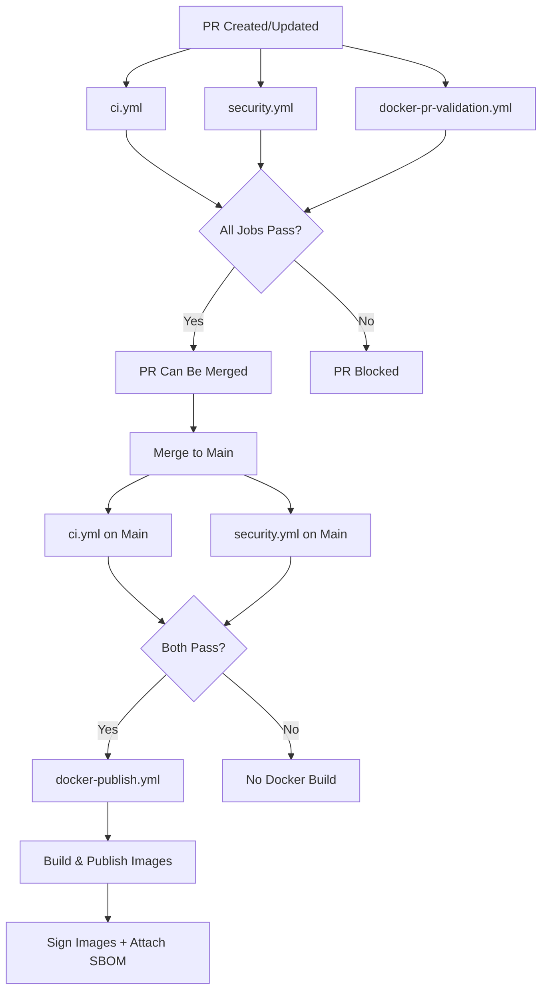

# Branch Protection & CI Gating


This document describes the strict CI gating strategy implemented for the `solve-it-mcp` repository to ensure code quality and prevent broken releases for forensic software.

---

## 🛡️ Overview

**Goal**: Prevent merging code to `main` and publishing Docker images unless all quality, security, and build validation checks pass.

**Strategy**: Multi-layered protection using:
1. GitHub Branch Protection Rules (required checks)
2. Separate focused workflows (parallel execution for speed)
3. Docker-only builds on main branch (no PR noise)
4. Forensic integrity features (SBOM, image signing, provenance)

---

## 📋 Branch Protection Rules

### Configuring Branch Protection for `main`

Navigate to: **Settings → Branches → Branch protection rules → Add rule**

#### Required Settings:

```yaml
Branch name pattern: main

☑ Require a pull request before merging
  ☑ Require approvals: 0 (or 1+ for team review)
  ☑ Dismiss stale pull request approvals when new commits are pushed
  ☑ Require review from Code Owners: ☐ (optional)

☑ Require status checks to pass before merging
  ☑ Require branches to be up to date before merging
  
  Required status checks (add these exact names):
    - CI Summary              (from ci.yml)
    - Security Summary        (from security.yml)
    - PR Validation Summary   (from docker-pr-validation.yml)
  
  Note: These are the summary jobs that depend on all other checks passing.

☑ Require conversation resolution before merging

☑ Require linear history (recommended for forensic audit trail)

☑ Do not allow bypassing the above settings
  ☐ Allow specific actors to bypass (optional - for emergencies only)

☐ Restrict who can push to matching branches (optional)

☑ Allow force pushes: ☐ DISABLED (protects git history)
☑ Allow deletions: ☐ DISABLED (prevents branch deletion)
```

---

## 🔄 Workflow Architecture

### New Modular Workflow Structure

The repository now uses **4 separate focused workflows** instead of one monolithic CI:

#### 1. **ci.yml** - Code Quality & Tests (~5 min)
- Ruff linting & formatting
- MyPy type checking  
- Pytest with coverage (Python 3.11 & 3.12)
- YAML validation
- **Runs on:** PR + Main push

#### 2. **security.yml** - Vulnerability Scanning (~3 min)
- Bandit (Python security)
- pip-audit & Safety (dependency vulnerabilities)
- Hadolint (Dockerfile security)
- TruffleHog (secret scanning)
- **Runs on:** PR + Main push + Daily schedule

#### 3. **docker-pr-validation.yml** - Build Validation (~12 min)
- Single-arch Docker build (linux/amd64)
- Health check tests (/healthz, /readyz)
- Multi-arch build verification
- Trivy security scan
- **Runs on:** PR only
- **Does NOT publish images**

#### 4. **docker-publish.yml** - Production Build (~20 min)
- Multi-arch builds (amd64, arm64, arm/v7)
- SBOM generation (SPDX, CycloneDX)
- Image signing with Cosign (keyless)
- Provenance attestation
- Push to Docker Hub
- Full Trivy scans
- **Runs on:** Main push + Git tags only

### Workflow Execution Flow



### Benefits of This Architecture

**For Pull Requests:**
- ✅ Fast parallel feedback (~12 min total)
- ✅ Clear separation of concerns
- ✅ Build validation without publishing
- ✅ Security checks before merge

**For Main Branch:**
- ✅ Production builds only after all checks pass
- ✅ No wasted Docker builds on PRs
- ✅ Complete forensic audit trail
- ✅ SBOM and signatures for compliance

**For Forensic Software:**
- ✅ Every image traceable to source commit
- ✅ SBOM lists all dependencies
- ✅ Cryptographic signatures verify integrity
- ✅ Provenance attestation proves build source

---

## 🔍 Workflow Gating Strategy

### How CI Gating Works

**Branch Protection** enforces that all required status checks pass before allowing merge:

1. **CI Summary** - Must pass (from ci.yml)
2. **Security Summary** - Must pass (from security.yml)  
3. **PR Validation Summary** - Must pass (from docker-pr-validation.yml)

Each summary job only succeeds if **all** its dependent jobs pass.

### Docker Publish Gating

The `docker-publish.yml` workflow:
- ✅ Only triggered by **main branch push** or **git tags**
- ✅ Never runs on PRs (no wasted builds)
- ✅ Relies on GitHub branch protection (CI must pass before merge allowed)
- ✅ Includes verify-ci job as safety check

---

## 🎯 Required Checks Breakdown

### Workflow: ci.yml (Code Quality & Tests)

**Must Pass Before Merge:**

#### 1. Code Quality Job
- **Checks**: Ruff linting, Ruff formatting, MyPy type checking
- **Duration**: ~2 minutes
- **Failure**: Blocks merge

#### 2. Unit Tests (Python 3.11 & 3.12)
- **Jobs**: Matrix across Python versions
- **Checks**: pytest with coverage, Codecov upload
- **Duration**: ~3 minutes per version
- **Failure**: Blocks merge

#### 3. YAML Linting
- **Checks**: yamllint on workflow files
- **Duration**: ~1 minute
- **Failure**: Blocks merge

#### 4. CI Summary
- **Checks**: Aggregates all ci.yml job results
- **Duration**: ~10 seconds
- **Failure**: Blocks merge if any ci.yml job failed

### Workflow: security.yml (Vulnerability Scanning)

**Must Pass Before Merge:**

#### 1. Code Security (Bandit)
- **Checks**: Python code security issues
- **Duration**: ~1 minute
- **Failure**: Blocks merge

#### 2. Dependency Security
- **Checks**: pip-audit & Safety for vulnerable dependencies
- **Duration**: ~1 minute
- **Failure**: Blocks merge

#### 3. Dockerfile Security (Hadolint)
- **Checks**: Dockerfile best practices and security
- **Duration**: ~1 minute
- **Failure**: Blocks merge

#### 4. Secret Scanning
- **Checks**: TruffleHog for exposed secrets
- **Duration**: ~1 minute
- **Failure**: Warning (doesn't block, but should be reviewed)

#### 5. Security Summary
- **Checks**: Aggregates all security.yml job results
- **Duration**: ~10 seconds
- **Failure**: Blocks merge if any security job failed

### Workflow: docker-pr-validation.yml (Build Validation)

**Must Pass Before Merge:**

#### 1. Build & Test (AMD64)
- **Checks**: Docker build, health checks (/healthz, /readyz), multi-arch capability
- **Duration**: ~8 minutes
- **Failure**: Blocks merge

#### 2. Trivy Security Scan
- **Checks**: Container image vulnerabilities
- **Duration**: ~3 minutes
- **Failure**: Blocks merge if CRITICAL vulnerabilities found

#### 3. PR Validation Summary
- **Checks**: Aggregates all docker-pr-validation.yml job results
- **Duration**: ~10 seconds
- **Failure**: Blocks merge if any validation job failed

---

## ⚙️ How It Works

### Scenario 1: Normal PR Flow

```bash
1. Developer creates PR
   ↓
2. Three workflows run in PARALLEL:
   ├─ ci.yml (~5 min)
   │  ├─ Code Quality ✅
   │  ├─ Tests (3.11) ✅
   │  ├─ Tests (3.12) ✅
   │  └─ YAML Lint ✅
   │
   ├─ security.yml (~3 min)
   │  ├─ Bandit ✅
   │  ├─ pip-audit ✅
   │  ├─ Hadolint ✅
   │  └─ Secret Scan ✅
   │
   └─ docker-pr-validation.yml (~12 min)
      ├─ Build & Test ✅
      └─ Trivy Scan ✅
   ↓
3. Total time: ~12 minutes (parallel execution)
   ↓
4. All 3 summary jobs pass:
   ├─ CI Summary ✅
   ├─ Security Summary ✅
   └─ PR Validation Summary ✅
   ↓
5. "Merge" button ENABLED
   ↓
6. Maintainer merges PR
   ↓
7. ci.yml + security.yml run on main
   ↓
8. Both pass → docker-publish.yml triggered
   ├─ verify-ci job ✅
   ├─ Multi-arch builds (amd64, arm64, arm/v7)
   ├─ SBOM generation
   ├─ Image signing
   ├─ Full Trivy scans
   └─ Push to Docker Hub
```

### Scenario 2: Tests Fail on PR

```bash
1. Developer creates PR
   ↓
2. Workflows run
   ├─ ci.yml
   │  ├─ Code Quality ✅
   │  └─ Tests (3.11) ❌ FAILED
   ├─ security.yml ✅
   └─ docker-pr-validation.yml ✅
   ↓
3. CI Summary ❌ FAILED
   ↓
4. "Merge" button DISABLED
   ↓
5. Developer fixes tests, pushes commit
   ↓
6. Workflows run again
   └─ All checks ✅
   ↓
7. "Merge" button ENABLED
```

### Scenario 3: Security Vulnerability Found

```bash
1. Developer creates PR
   ↓
2. security.yml runs
   ├─ Bandit ✅
   ├─ pip-audit ✅
   ├─ Hadolint ❌ CRITICAL issue found
   └─ Secret Scan ✅
   ↓
3. Security Summary ❌ FAILED
   ↓
4. "Merge" button DISABLED
   ↓
5. Developer fixes Dockerfile, updates PR
   ↓
6. security.yml runs again
   └─ All checks ✅
   ↓
7. "Merge" button ENABLED
```

### Scenario 4: Release Tag Created

```bash
1. Maintainer creates tag: v0.2025-10-0.1.0
   ↓
2. Tag pushed to GitHub
   ↓
3. docker-publish.yml triggered by tag
   ├─ verify-ci job ✅ (checks main branch CI)
   ├─ Multi-arch builds
   ├─ SBOM generation
   ├─ Image signing
   ├─ Version tags: v0.2025-10-0.1.0, latest
   ├─ Full Trivy scans
   └─ Push to Docker Hub
```

### Scenario 5: Monthly SOLVE-IT Update

```bash
1. Monthly cron trigger (1st of month, 3 AM UTC)
   ↓
2. docker-monthly.yml runs
   ├─ Check SOLVE-IT latest release
   ├─ Compare with published version
   └─ New version found? v0.2025-11
   ↓
3. Calls docker-publish.yml workflow
   ├─ Create new release tag
   ├─ Build with new SOLVE-IT data
   ├─ Full security scans
   └─ Publish
```

---

## 🚨 Bypassing Protection (Emergency Only)

### When to Bypass:
- ✅ Critical security hotfix needed immediately
- ✅ Known flaky test, but code is verified manually
- ✅ CI infrastructure issue (GitHub Actions outage)

### How to Bypass:

#### Method 1: Workflow Dispatch (Recommended)
```bash
# Go to Actions → Docker Build and Publish → Run workflow
# Select branch: main
# Run manually (skips verify-ci for workflow_dispatch events)
```

#### Method 2: Temporarily Disable Branch Protection
```bash
# Settings → Branches → Edit rule for main
# Temporarily uncheck "Require status checks to pass"
# Merge PR
# RE-ENABLE protection immediately!
```

#### Method 3: Admin Override (If enabled)
```bash
# Only if "Allow specific actors to bypass" is configured
# Admin can merge despite failing checks
# Should be logged and reviewed
```

**⚠️ IMPORTANT**: Document all bypasses in a GitHub Issue with:
- Reason for bypass
- Timestamp
- Who authorized it
- Follow-up action to fix root cause

---

## 📊 Monitoring & Alerts

### Check Workflow Status

**GitHub Actions Page**:
- https://github.com/3soos3/solve-it-mcp/actions

**Workflow Badges** (add to README):
```markdown
[](https://github.com/3soos3/solve-it-mcp/actions)
[](https://github.com/3soos3/solve-it-mcp/actions)
```

### Email Notifications

Configure in: **Settings → Notifications → Actions**
- ☑ Send notifications for failed workflows
- ☑ Include workflow logs

---

## 🧪 Testing the Setup

### Test 1: Verify Branch Protection

```bash
# Try to push directly to main (should fail)
git checkout main
git commit --allow-empty -m "test: direct push"
git push origin main
# Expected: remote rejected (branch protected)
```

### Test 2: Verify CI Gating

```bash
# Create PR with failing test
# 1. Add a failing test to tests/
# 2. Create PR
# 3. Verify "Merge" button is disabled
# 4. Check "Required" status checks section
```

### Test 3: Verify Docker Workflow Gating

```bash
# Check workflow file
cat .github/workflows/docker-publish.yml | grep -A5 "verify-ci"

# Expected: Job exists and checks CI status
```

---

## 📝 Step-by-Step Setup Instructions

### 1. Enable Branch Protection

```bash
1. Go to: https://github.com/3soos3/solve-it-mcp/settings/branches
2. Click "Add rule" or "Edit" for existing main rule
3. Branch name pattern: main
4. Enable these checkboxes:
   ☑ Require a pull request before merging
   ☑ Require status checks to pass before merging
   ☑ Require branches to be up to date before merging
5. In "Status checks that are required", search and add:
   - CI Summary
   - Security Summary
   - PR Validation Summary
6. Click "Create" or "Save changes"
```

### 2. Verify Workflow Files

```bash
# Ensure workflows are in place
ls -la .github/workflows/
# Should show:
# - ci.yml (Code Quality & Tests)
# - security.yml (Vulnerability Scanning)
# - docker-pr-validation.yml (PR Build Validation)
# - docker-publish.yml (Production Build & Publish)
# - docker-monthly.yml (Smart Monthly Rebuilds)
```

### 3. Test the Setup

```bash
# Create a test PR
git checkout -b test/branch-protection
echo "# Test" >> TEST.md
git add TEST.md
git commit -m "test: branch protection"
git push -u origin test/branch-protection

# Create PR on GitHub
# Verify CI runs automatically
# Verify merge button state
```

### 4. Monitor First Real PR

```bash
# After setup, monitor first real PR:
# 1. Check all CI jobs run
# 2. Check status checks appear in PR
# 3. Verify merge button behavior
# 4. Check Docker workflow triggers after merge
```

---

## 🔧 Troubleshooting

### Issue: "Merge" button enabled despite failing CI

**Cause**: Status checks not configured correctly in branch protection

**Fix**:
1. Go to branch protection settings
2. Ensure "Require status checks to pass" is checked
3. Verify exact job names match what appears in Actions tab
4. Job names are case-sensitive!

### Issue: Docker workflow runs even though CI failed

**Cause**: `verify-ci` job not working correctly

**Fix**:
```bash
# Check workflow logs
# Look for "Verify CI Status" job
# Check if it's being skipped incorrectly
# Verify the if conditions in the job
```

### Issue: CI checks not appearing in PR

**Cause**: CI workflow not triggering on PRs

**Fix**:
```yaml
# In .github/workflows/ci.yml, verify:
on:
  pull_request:
    branches:
      - main
```

### Issue: Status check names don't match

**Cause**: Job names in workflow don't match configured status checks

**Fix**:
```bash
# Job name in workflow file MUST match status check name
# Example:
# Workflow: name: "Code Quality"
# Branch protection: Add status check "Code Quality" (exact match)
```

---

## 📚 Additional Resources

- [GitHub Branch Protection Docs](https://docs.github.com/en/repositories/configuring-branches-and-merges-in-your-repository/managing-protected-branches/about-protected-branches)
- [GitHub Actions Status Checks](https://docs.github.com/en/pull-requests/collaborating-with-pull-requests/collaborating-on-repositories-with-code-quality-features/about-status-checks)
- [Workflow Triggers](https://docs.github.com/en/actions/using-workflows/events-that-trigger-workflows)

---

## 🔐 Forensic Software Features

### SBOM (Software Bill of Materials)

Every published Docker image includes an SBOM for complete dependency transparency:

**Formats Generated:**
- **SPDX JSON** - Industry standard, ISO/IEC 5962:2021 compliant
- **CycloneDX JSON** - OWASP standard for software supply chain
- **Syft JSON** - Anchore's detailed format

**How to Access:**
```bash
# Download SBOM from GitHub artifacts
gh run download <run-id> --name sbom-<commit-sha>

# View SBOM attached to image (requires cosign)
cosign download sbom 3soos3/solve-it-mcp:latest

# View SBOM in container
docker run --rm 3soos3/solve-it-mcp:latest cat /sbom/sbom.spdx.json
```

**Use Cases:**
- Compliance audits (GDPR, HIPAA, PCI-DSS)
- Vulnerability tracking across fleet
- License compliance verification
- Evidence chain of custody

### Image Signing with Cosign

All images are cryptographically signed using **Sigstore Cosign** (keyless signing):

**Verification:**
```bash
# Verify image signature
cosign verify 3soos3/solve-it-mcp:latest \
  --certificate-identity-regexp=github \
  --certificate-oidc-issuer=https://token.actions.githubusercontent.com

# Expected output:
# ✓ Verified signature
# ✓ Certificate identity matches
# ✓ OIDC issuer matches
```

**Provenance:**
```bash
# View build provenance
cosign download attestation 3soos3/solve-it-mcp:latest | jq

# Shows:
# - Source repository
# - Commit SHA
# - Build workflow
# - Build timestamp
# - Builder identity
```

**Forensic Benefits:**
- **Integrity**: Prove image hasn't been tampered with
- **Authenticity**: Verify image source and builder
- **Non-repudiation**: Signatures are tied to GitHub identity
- **Transparency**: Public Sigstore transparency log (Rekor)

### Audit Trail

Complete traceable history for every Docker image:

**Image Tags Include:**
- `sha-<commit>` - Exact source commit
- `v<version>` - Release version
- `latest` - Current stable

**Metadata in Image Labels:**
```bash
docker inspect 3soos3/solve-it-mcp:latest | jq '.[0].Config.Labels'

# Shows:
# - org.opencontainers.image.created
# - org.opencontainers.image.revision (git commit)
# - org.opencontainers.image.source (repo URL)
# - org.opencontainers.image.version
```

**CI/CD Artifacts:**
- Workflow logs (retained 90 days)
- Security scan results (SARIF format)
- Test coverage reports
- SBOM files

**GitHub Audit:**
- All commits signed/verified
- PR reviews required
- Branch protection enforced
- Workflow runs logged

---

## ✅ Checklist for New Repositories

- [ ] Enable branch protection for `main`
- [ ] Configure required status checks (CI Summary, Security Summary, PR Validation Summary)
- [ ] Add all 4 workflows (ci, security, docker-pr-validation, docker-publish)
- [ ] Set up Docker Hub secrets (DOCKERHUB_USERNAME, DOCKERHUB_TOKEN)
- [ ] Test with a failing PR (verify blocked)
- [ ] Test with a passing PR (verify can merge)
- [ ] Verify Docker workflow only runs on main
- [ ] Verify SBOM generation works
- [ ] Verify image signing works
- [ ] Document bypass procedures
- [ ] Set up monitoring/alerts
- [ ] Add workflow badges to README

---

## 🎯 Summary

**What This Setup Provides**:
- ✅ No broken code can be merged to main
- ✅ No Docker images built from failing checks
- ✅ Fast parallel feedback (~12 min for PRs)
- ✅ Automated quality gates at every step
- ✅ Clear separation of concerns
- ✅ Complete forensic audit trail
- ✅ SBOM for compliance
- ✅ Cryptographic image signatures
- ✅ Provenance attestation

**Forensic Software Benefits**:
- ✅ Every image traceable to source commit
- ✅ Complete dependency transparency (SBOM)
- ✅ Cryptographic integrity verification
- ✅ Non-repudiatable build provenance
- ✅ Compliance-ready audit trail
- ✅ Court-defensible evidence chain

**Maintenance Required**:
- Review status check names when workflows change
- Update branch protection rules if adding new critical checks
- Monitor security scans for new vulnerabilities
- Rotate Docker Hub tokens annually
- Document any bypass usage

**Questions or Issues?**
- File an issue: https://github.com/3soos3/solve-it-mcp/issues
- Workflow docs: `.github/workflows/README.md`
