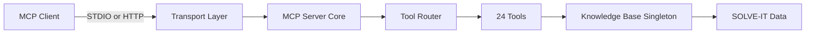

# Architecture Overview

High-level architecture and design of SOLVE-IT MCP Server.

## System Components

## Core Components

### Transport Layer

- **STDIO Transport**: For desktop MCP clients (Claude Desktop, Cline, etc.) — default locally
- **HTTP/SSE Transport**: For web clients and Kubernetes deployments — default in Docker

Protocol version: `2025-11-25`

### MCP Server Core

- Implements the Model Context Protocol specification
- Tool registry managing 24 forensic investigation tools
- Request router dispatching to the correct handler

### Knowledge Base (Singleton)

A single `KnowledgeBase` instance is shared across all 24 tools, loaded once at startup.

- **Startup time**: ~1 second
- **Query response**: sub-second
- **Memory footprint**: ~100–200 MB

Previously each tool loaded its own instance (20 × ~1 s = 20 s startup). The shared architecture eliminates this.

### Observability

- OpenTelemetry: metrics, traces, and structured logs
- Correlation IDs: every request is traceable end-to-end
- Health checks: `/healthz` (liveness) and `/readyz` (readiness)

### Security

- Multi-layer input validation via Pydantic
- Request sanitization middleware
- Execution timeout per tool (45 s default)
- Non-root user (`mcpuser`, UID 1000) in container

## Deployment Modes

### Desktop (STDIO)

- Single-user, single-session
- Direct process communication
- Ideal for Claude Desktop, Cline, and other MCP clients

### Server (HTTP)

- Multi-user, stateless sessions
- REST API with SSE streaming
- Ideal for Kubernetes, production web deployments, and multi-user scenarios

## Technology Stack

| Component | Technology |
|---|---|
| Language | Python 3.12 |
| MCP SDK | Official Anthropic Python SDK |
| Web Server | Starlette + Uvicorn (ASGI) |
| Validation | Pydantic 2.x |
| Observability | OpenTelemetry |
| Container | Python 3.12-Alpine |
| Build | Multi-stage Docker |
| Architectures | `linux/amd64`, `linux/arm64`, `linux/arm/v7` |

## Related Documentation

- [Security Model](security-model.md)
- [Implementation Details](implementation.md)
- [Docker Deployment](../deployment/docker.md)
- [Kubernetes Deployment](../deployment/kubernetes.md)
