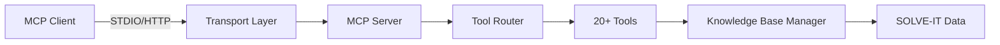

# Architecture Overview

High-level architecture and design of SOLVE-IT MCP Server.

!!! info "Work in Progress"
    Comprehensive architecture documentation is coming soon. For now, see [Implementation Details](implementation.md).

## System Components

## Core Components

### Transport Layer
- **STDIO Transport**: For desktop MCP clients (Claude Desktop, etc.)
- **HTTP/SSE Transport**: For web clients and Kubernetes deployments

### Server Core
- **MCP Protocol Handler**: Implements Model Context Protocol specification
- **Tool Registry**: Manages 20+ forensic investigation tools
- **Request Router**: Routes tool calls to appropriate handlers

### Data Layer
- **Knowledge Base Manager**: Singleton pattern for optimal performance
- **SOLVE-IT Library Integration**: Access to techniques, weaknesses, mitigations
- **Caching**: Sub-second response times

### Observability
- **OpenTelemetry**: Metrics, traces, and logs
- **Structured Logging**: JSON format with correlation IDs
- **Health Checks**: Kubernetes-ready liveness/readiness probes

### Security
- **Multi-layer Security**: Input validation, rate limiting, CORS
- **Security Middleware**: Request validation and sanitization
- **Audit Logging**: Complete request/response tracking

## Deployment Modes

### Desktop (STDIO)
- Single-user mode
- Direct process communication
- Ideal for: Claude Desktop, Cline, other MCP clients

### Server (HTTP)
- Multi-user mode
- REST API + Server-Sent Events
- Ideal for: Web applications, Kubernetes, production deployments

## Performance Characteristics

- **Startup Time**: ~1 second (with shared knowledge base)
- **Query Response**: Sub-second for most operations
- **Memory Footprint**: ~100-200MB
- **Container Size**: 181MB (Alpine-based)

## Technology Stack

- **Language**: Python 3.11/3.12
- **Framework**: MCP SDK (official Anthropic)
- **Web Server**: Starlette + Uvicorn (ASGI)
- **Validation**: Pydantic 2.0
- **Observability**: OpenTelemetry
- **Container**: Alpine Linux 3.23

## Related Documentation

- [Implementation Details](implementation.md) - Complete technical implementation
- [Security Model](security-model.md) - Security architecture
- [Docker Deployment](../deployment/docker.md)
- [Kubernetes Deployment](../deployment/kubernetes.md)
