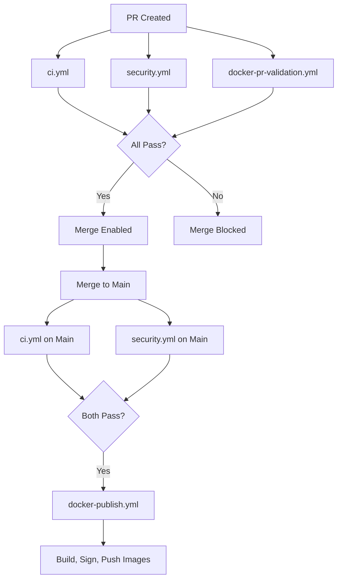

# Branch Protection & CI Gating

How CI gating is implemented to ensure code quality and prevent broken releases.

## Overview

**Goal**: Prevent merging code to `main` and publishing Docker images unless all quality, security, and build validation checks pass.

**Strategy**: Multi-layered protection using:

1. GitHub Branch Protection rules (required status checks)
2. Four focused parallel workflows
3. Docker builds run **only** on main-branch push or tags — never on PRs

---

## Workflow Architecture



### Workflow Summary

| Workflow | Trigger | Duration | Publishes? |
|---|---|---|---|
| `ci.yml` | PR + main push | ~5 min | No |
| `security.yml` | PR + main push + daily | ~3 min | No |
| `docker-pr-validation.yml` | PR only | ~12 min | No |
| `docker-publish.yml` | Main push + tags only | ~20 min | Yes |

---

## Required Status Checks

Configure in **Settings → Branches → Branch protection rules** for `main`:

```
☑ Require a pull request before merging
☑ Require status checks to pass before merging
  ☑ Require branches to be up to date before merging

  Required checks:
    - CI Summary              (from ci.yml)
    - Security Summary        (from security.yml)
    - PR Validation Summary   (from docker-pr-validation.yml)

☑ Require conversation resolution before merging
☑ Require linear history
☑ Do not allow bypassing the above settings
☐ Allow force pushes    (DISABLED)
☐ Allow deletions       (DISABLED)
```

---

## PR Lifecycle

### Normal PR (all checks pass)

```
1. PR created
2. ci.yml + security.yml + docker-pr-validation.yml run in parallel (~12 min)
3. All summary jobs pass
4. Merge button enabled
5. Merge to main
6. ci.yml + security.yml run on main
7. Both pass → docker-publish.yml triggers
8. Multi-arch build, SBOM, signing, push to Docker Hub + GHCR
```

### Failing PR

```
1. PR created
2. A check fails (e.g. tests fail in ci.yml)
3. CI Summary fails
4. Merge button disabled
5. Developer fixes issue, pushes commit
6. All checks rerun
7. Merge button enabled
```

---

## Forensic Features

Every published Docker image includes:

- **Cosign signature** — proves the image was built by the official workflow
- **SBOM** (SPDX JSON + CycloneDX JSON) — complete dependency transparency
- **SLSA provenance attestation** — source commit, workflow, builder identity, timestamp
- **OCI labels** — `image.revision`, `image.created`, `image.source`

These are attached to GHCR images and accessible via Cosign:

```bash
cosign verify ghcr.io/3soos3/solve-it-mcp:latest \
  --certificate-identity-regexp=github \
  --certificate-oidc-issuer=https://token.actions.githubusercontent.com

cosign download sbom ghcr.io/3soos3/solve-it-mcp:latest

cosign download attestation ghcr.io/3soos3/solve-it-mcp:latest | jq
```

---

## Emergency Bypass

Only use in genuine emergencies (critical security hotfix, CI infrastructure outage).

**Recommended approach — workflow dispatch:**

Go to Actions → Docker Build and Publish → Run workflow → Select `main`.

**Alternative — temporarily disable branch protection:**

1. Settings → Branches → Edit rule for `main`
2. Uncheck "Require status checks to pass"
3. Merge PR
4. **Immediately re-enable protection**
5. Document in a GitHub Issue: reason, timestamp, who authorized, follow-up action

---

## Troubleshooting

### Merge button enabled despite failing CI

Status checks not configured correctly. Verify:

1. "Require status checks to pass" is checked in branch protection
2. The exact job names match (case-sensitive)
3. Status check names use the summary job names listed above

### CI checks not appearing in PR

Verify the `on.pull_request` trigger in `.github/workflows/ci.yml` targets `main`.

### Docker workflow runs despite CI failure

Check the `verify-ci` job in `docker-publish.yml` — it should gate the publish on the CI status of the last main-branch commit.

---

## Related Documentation

- [Releases](releases.md) — creating and publishing releases
- [Local Testing](local-testing.md) — running checks locally
- [Architecture Implementation](../architecture/implementation.md) — full CI/CD pipeline overview
